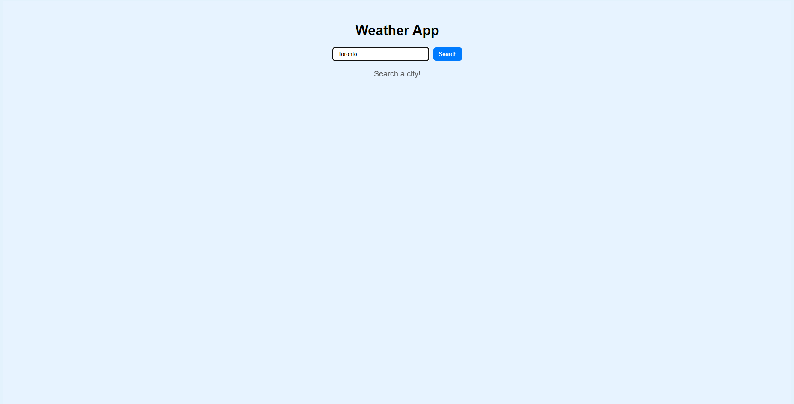
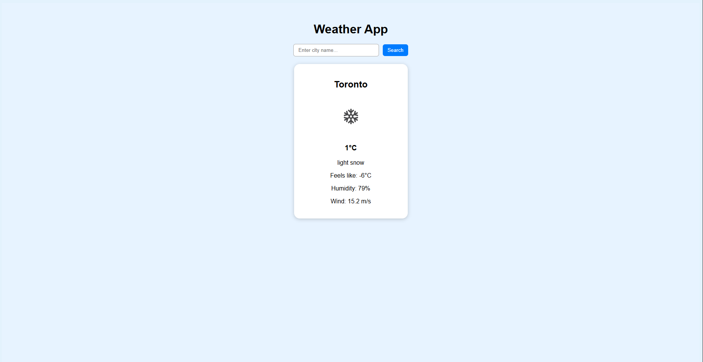
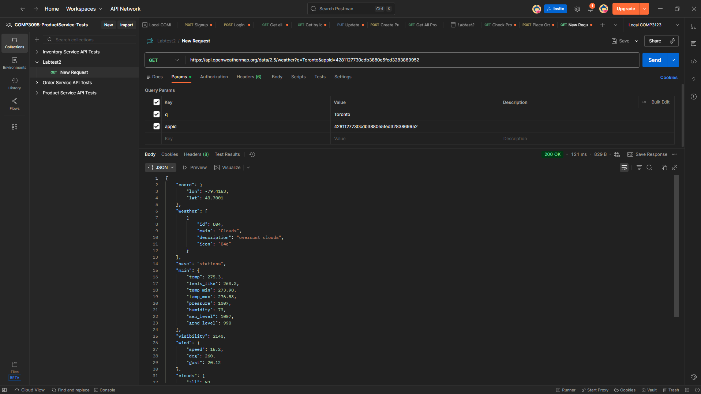

# 1013661676_comp3123_labtest2 – Weather App
**Student:** Iqbal Qureshi  
**Student ID:** 1013661676  
**Course:** COMP3123 – Full Stack Development I  
**Lab Test 2**

## Project Description
This is a simple React weather application that fetches real-time weather data using the OpenWeatherMap API. Users can search any city and view temperature, description, humidity, wind speed, and an icon representing the weather condition.

## Features
- Search bar for entering city names
- Displays temperature, weather description, humidity, wind speed
- Weather icons supplied by OpenWeatherMap
- Simple UI using CSS

## API Used
OpenWeatherMap Current Weather API  
`https://api.openweathermap.org/data/2.5/weather`

## Setup Instructions
1. Clone the project
2. Run: `npm install`
3. Add your API key inside App.js
4. Run the app: `npm start`

## Screenshots
## Screenshots

### Home Page

### Search Result

### Weekly Forecast

### Postman Result

## Hosting Link
(Your Vercel link after deployment)
